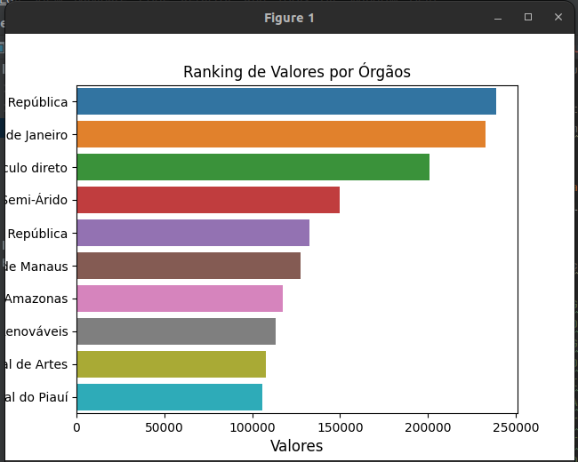
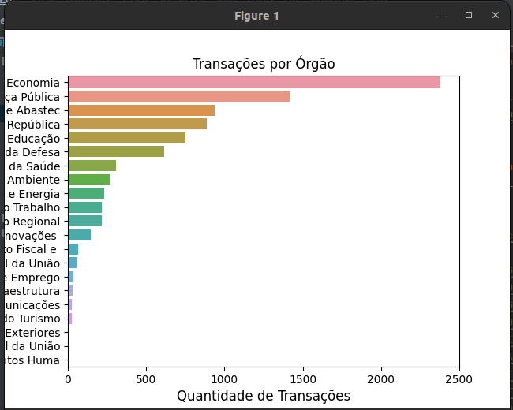
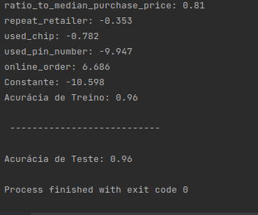

# Análise de dados com Python

O projeto tem como intuito de analisar dados e realizar a regressão e a classificação

### 🔧 Instalação

Executar a instalação do requirements.txt

## 🚀 Começando

Para executar o projeto basta executar o arquivo analiseDeDados.py

### ⌨️ Testando a aplicação

Realizar testes e validar a acurácia exibida

## 🎁 Imagens da implementação em gráficos e resultados

## 🛠️ Primeira imagem de valores por órgãos

## 🛠️ Segunda imagem de transações por órgãos

## 🛠️ Terceira imagem é o resultado das implementações exibida no console

## ✒️ Autores

Alunos participantes do projeto
Hugo Leonardo Xavier
João Vitor Fonseca da Silva
Vitor Renato Michelucci 

